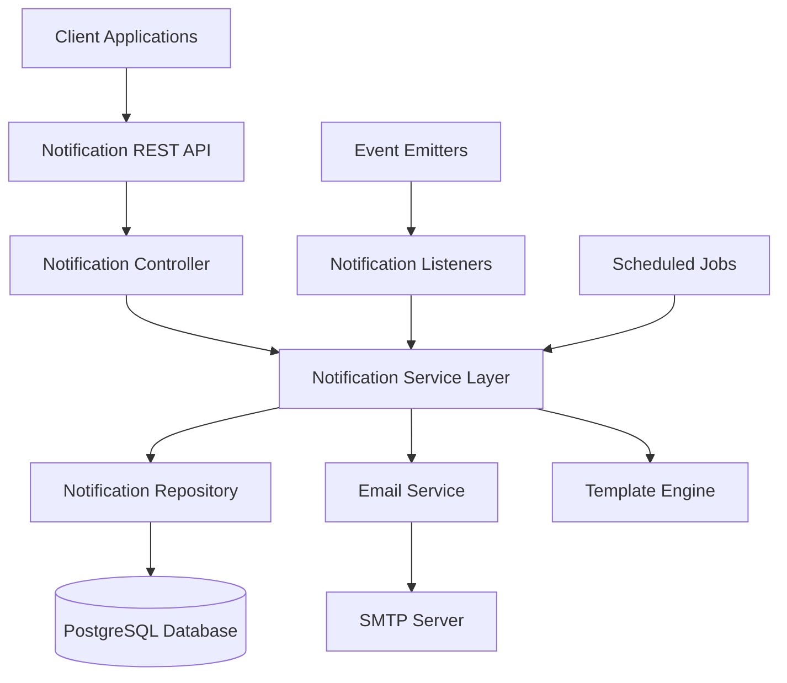
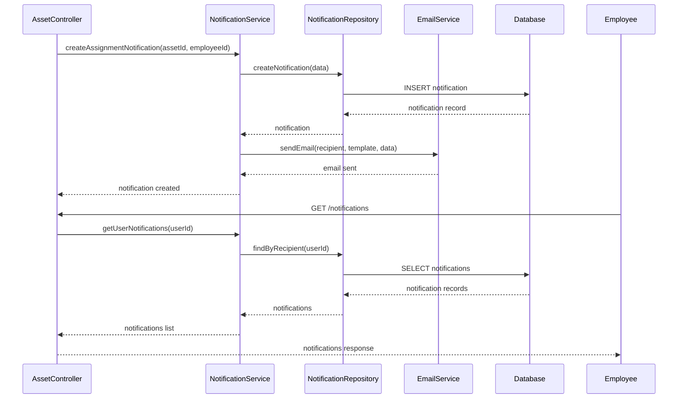
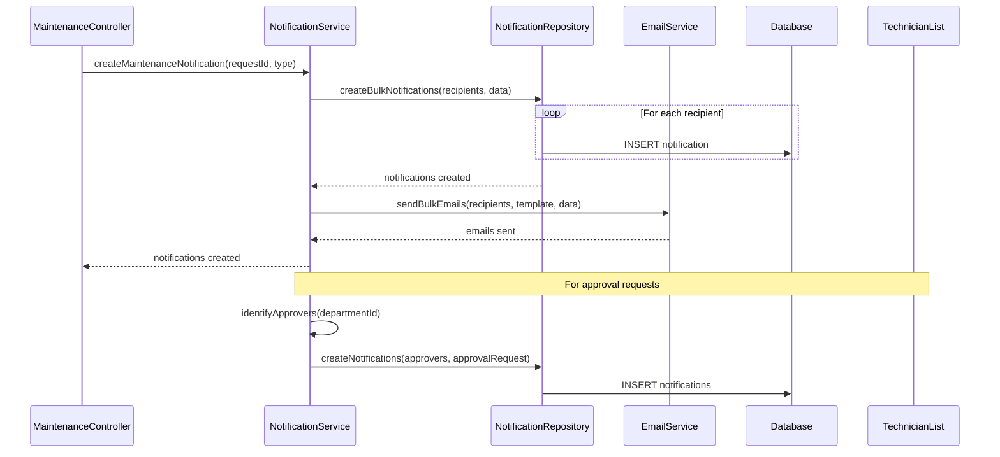
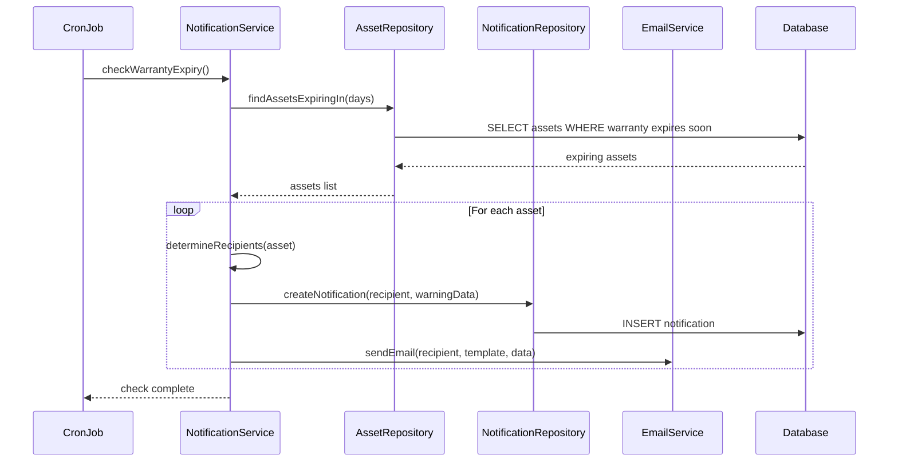

# Design Document: Notification Service

## Overview

The Notification Service is a comprehensive notification management system for the asset management platform. It provides multi-channel notification delivery (email and in-app), real-time alerts for critical events, and a unified API for managing notifications. The service handles assignment alerts, maintenance notifications, warranty expiry warnings, and approval workflows with support for unread tracking and bulk operations.

The system integrates with existing employee and asset management modules, leveraging the current authentication and authorization infrastructure while providing extensible notification templates and delivery mechanisms.

## Architecture

The notification system follows a layered architecture with clear separation of concerns:



## Sequence Diagrams

### Assignment Alert Flow




### Maintenance Alert Flow



### Warranty Expiry Check Flow




## Components and Interfaces

### Component 1: NotificationController

**Purpose**: Handles HTTP requests for notification management operations

**Interface**:
```javascript
class NotificationController {
  async getUserNotifications(req, res): Promise<void>
  async getUnreadCount(req, res): Promise<void>
  async markAsRead(req, res): Promise<void>
  async markAllAsRead(req, res): Promise<void>
  async deleteNotification(req, res): Promise<void>
  async getNotificationById(req, res): Promise<void>
}
```

**Responsibilities**:
- Validate incoming HTTP requests
- Extract authentication context (user ID, role)
- Invoke notification service methods
- Format and send HTTP responses
- Handle errors and return appropriate status codes

### Component 2: NotificationService

**Purpose**: Core business logic for notification creation, delivery, and management

**Interface**:
```javascript
class NotificationService {
  async createNotification(data: NotificationCreateDto): Promise<Notification>
  async createBulkNotifications(recipients: string[], data: NotificationData): Promise<Notification[]>
  async getUserNotifications(userId: string, filters: NotificationFilters): Promise<PaginatedResult<Notification>>
  async getUnreadCount(userId: string): Promise<number>
  async markAsRead(notificationId: string, userId: string): Promise<Notification>
  async markAllAsRead(userId: string): Promise<number>
  async deleteNotification(notificationId: string, userId: string): Promise<boolean>
  
  // Event-driven notification creators
  async createAssignmentNotification(assetId: string, employeeId: string): Promise<Notification>
  async createMaintenanceNotification(requestId: string, type: MaintenanceNotificationType): Promise<Notification[]>
  async createWarrantyExpiryNotification(assetId: string): Promise<Notification[]>
  async createApprovalRequestNotification(requestId: string, approvers: string[]): Promise<Notification[]>
}
```

**Responsibilities**:
- Execute notification business logic
- Coordinate between repository, email service, and template engine
- Determine notification recipients based on business rules
- Manage notification lifecycle (create, update, delete)
- Aggregate notification data for dashboard views


### Component 3: NotificationRepository

**Purpose**: Data access layer for notification persistence operations

**Interface**:
```javascript
class NotificationRepository {
  async create(data: NotificationData): Promise<Notification>
  async createMany(data: NotificationData[]): Promise<Notification[]>
  async findById(id: string): Promise<Notification | null>
  async findByRecipient(userId: string, options: QueryOptions): Promise<PaginatedResult<Notification>>
  async countUnread(userId: string): Promise<number>
  async markAsRead(id: string, userId: string): Promise<Notification>
  async markAllAsRead(userId: string): Promise<number>
  async delete(id: string, userId: string): Promise<boolean>
  async deleteOldNotifications(olderThanDays: number): Promise<number>
}
```

**Responsibilities**:
- Execute database queries using Prisma ORM
- Transform database records to domain models
- Handle database errors and constraints
- Implement pagination and filtering
- Optimize queries with proper indexing

### Component 4: EmailService

**Purpose**: Handles email delivery through SMTP

**Interface**:
```javascript
class EmailService {
  async sendEmail(recipient: string, subject: string, body: string, options?: EmailOptions): Promise<boolean>
  async sendBulkEmails(recipients: string[], subject: string, body: string, options?: EmailOptions): Promise<BulkEmailResult>
  async sendTemplatedEmail(recipient: string, templateName: string, data: TemplateData): Promise<boolean>
  async verifyConnection(): Promise<boolean>
}
```

**Responsibilities**:
- Configure and maintain SMTP connection
- Send individual and bulk emails
- Handle email delivery failures and retries
- Log email delivery status
- Integrate with template engine for email content

### Component 5: TemplateEngine

**Purpose**: Renders notification templates with dynamic data

**Interface**:
```javascript
class TemplateEngine {
  async renderTemplate(templateName: string, data: TemplateData): Promise<string>
  async getTemplate(templateName: string): Promise<Template>
  async registerTemplate(name: string, content: string): Promise<void>
}
```

**Responsibilities**:
- Load and cache notification templates
- Replace template variables with actual data
- Support both email and in-app notification templates
- Provide default templates for standard notification types


## Data Models

### Model 1: Notification

```javascript
interface Notification {
  id: string
  recipientId: string
  type: NotificationType
  title: string
  message: string
  data: Record<string, any>
  read: boolean
  readAt: Date | null
  emailSent: boolean
  emailSentAt: Date | null
  createdAt: Date
  updatedAt: Date
}
```

**Validation Rules**:
- `id`: UUID, auto-generated
- `recipientId`: Required, must reference existing Employee
- `type`: Required, must be one of valid NotificationType enum values
- `title`: Required, max length 200 characters
- `message`: Required, max length 1000 characters
- `data`: Optional JSON object for additional context
- `read`: Boolean, defaults to false
- `emailSent`: Boolean, defaults to false

### Model 2: NotificationType (Enum)

```javascript
enum NotificationType {
  ASSET_ASSIGNED = 'ASSET_ASSIGNED',
  ASSET_UNASSIGNED = 'ASSET_UNASSIGNED',
  MAINTENANCE_REQUESTED = 'MAINTENANCE_REQUESTED',
  MAINTENANCE_APPROVED = 'MAINTENANCE_APPROVED',
  MAINTENANCE_REJECTED = 'MAINTENANCE_REJECTED',
  MAINTENANCE_ASSIGNED = 'MAINTENANCE_ASSIGNED',
  MAINTENANCE_COMPLETED = 'MAINTENANCE_COMPLETED',
  WARRANTY_EXPIRING = 'WARRANTY_EXPIRING',
  WARRANTY_EXPIRED = 'WARRANTY_EXPIRED',
  APPROVAL_REQUEST = 'APPROVAL_REQUEST',
  APPROVAL_APPROVED = 'APPROVAL_APPROVED',
  APPROVAL_REJECTED = 'APPROVAL_REJECTED'
}
```

### Model 3: NotificationCreateDto

```javascript
interface NotificationCreateDto {
  recipientId: string
  type: NotificationType
  title: string
  message: string
  data?: Record<string, any>
  sendEmail?: boolean
}
```

**Validation Rules**:
- All fields follow same validation as Notification model
- `sendEmail`: Optional boolean, defaults to true


### Model 4: NotificationFilters

```javascript
interface NotificationFilters {
  type?: NotificationType
  read?: boolean
  startDate?: Date
  endDate?: Date
  page?: number
  limit?: number
  sortBy?: string
  sortOrder?: 'asc' | 'desc'
}
```

**Validation Rules**:
- `type`: Optional, must be valid NotificationType
- `read`: Optional boolean
- `startDate`: Optional ISO date string
- `endDate`: Optional ISO date string, must be after startDate
- `page`: Optional positive integer, defaults to 1
- `limit`: Optional positive integer between 1-100, defaults to 20
- `sortBy`: Optional, must be valid Notification field
- `sortOrder`: Optional, either 'asc' or 'desc', defaults to 'desc'

### Model 5: EmailOptions

```javascript
interface EmailOptions {
  from?: string
  replyTo?: string
  cc?: string[]
  bcc?: string[]
  attachments?: EmailAttachment[]
  html?: boolean
}
```

### Model 6: PaginatedResult<T>

```javascript
interface PaginatedResult<T> {
  data: T[]
  meta: {
    total: number
    page: number
    limit: number
    totalPages: number
    hasNext: boolean
    hasPrevious: boolean
  }
}
```


## Algorithmic Pseudocode

### Main Notification Creation Algorithm

```javascript
/**
 * Creates a notification and optionally sends email
 * 
 * Preconditions:
 * - data.recipientId references valid Employee
 * - data.type is valid NotificationType
 * - data.title is non-empty string (max 200 chars)
 * - data.message is non-empty string (max 1000 chars)
 * 
 * Postconditions:
 * - Notification record created in database
 * - If sendEmail is true, email is sent asynchronously
 * - Returns complete Notification object
 * - On failure, throws appropriate error
 */
async function createNotification(data) {
  // Step 1: Validate recipient exists
  const recipient = await employeeRepository.findById(data.recipientId)
  if (!recipient) {
    throw new Error('Recipient not found')
  }
  
  // Step 2: Create notification record
  const notificationData = {
    recipientId: data.recipientId,
    type: data.type,
    title: data.title,
    message: data.message,
    data: data.data || {},
    read: false,
    emailSent: false
  }
  
  const notification = await notificationRepository.create(notificationData)
  
  // Step 3: Send email asynchronously if requested
  if (data.sendEmail !== false) {
    // Non-blocking email send
    sendEmailAsync(recipient.email, notification)
      .catch(error => logger.error('Email send failed', error))
  }
  
  return notification
}
```

### Bulk Notification Creation Algorithm

```javascript
/**
 * Creates multiple notifications for different recipients
 * 
 * Preconditions:
 * - recipients is non-empty array of valid employee IDs
 * - data contains valid notification data
 * - All recipients exist in database
 * 
 * Postconditions:
 * - One notification created per recipient
 * - Emails sent to all recipients if sendEmail is true
 * - Returns array of created notifications
 * - Partial failures logged but don't stop processing
 * 
 * Loop Invariants:
 * - All processed recipients have valid notifications
 * - Failed creations are logged and skipped
 */
async function createBulkNotifications(recipients, data) {
  const notifications = []
  const failedRecipients = []
  
  // Step 1: Validate all recipients exist
  const validRecipients = await validateRecipients(recipients)
  
  // Step 2: Create notification for each recipient
  for (const recipientId of validRecipients) {
    try {
      const notification = await notificationRepository.create({
        recipientId,
        type: data.type,
        title: data.title,
        message: data.message,
        data: data.data || {},
        read: false,
        emailSent: false
      })
      
      notifications.push(notification)
    } catch (error) {
      failedRecipients.push(recipientId)
      logger.error(`Failed to create notification for ${recipientId}`, error)
    }
  }
  
  // Step 3: Send bulk emails if requested
  if (data.sendEmail !== false && notifications.length > 0) {
    const emailRecipients = notifications.map(n => ({
      email: n.recipient.email,
      notificationId: n.id
    }))
    
    sendBulkEmailsAsync(emailRecipients, data)
      .catch(error => logger.error('Bulk email failed', error))
  }
  
  return notifications
}
```


### User Notifications Retrieval Algorithm

```javascript
/**
 * Retrieves paginated notifications for a user with filters
 * 
 * Preconditions:
 * - userId references valid Employee
 * - filters.page >= 1
 * - filters.limit between 1 and 100
 * - If filters.endDate exists, it must be after filters.startDate
 * 
 * Postconditions:
 * - Returns paginated result with notifications
 * - Notifications ordered by createdAt descending (newest first)
 * - Meta information includes pagination details
 * - Empty array returned if no notifications match
 */
async function getUserNotifications(userId, filters) {
  // Step 1: Validate user exists
  const user = await employeeRepository.findById(userId)
  if (!user) {
    throw new Error('User not found')
  }
  
  // Step 2: Build query filters
  const queryFilters = {
    recipientId: userId
  }
  
  if (filters.type) {
    queryFilters.type = filters.type
  }
  
  if (filters.read !== undefined) {
    queryFilters.read = filters.read
  }
  
  if (filters.startDate) {
    queryFilters.createdAt = { gte: new Date(filters.startDate) }
  }
  
  if (filters.endDate) {
    queryFilters.createdAt = {
      ...queryFilters.createdAt,
      lte: new Date(filters.endDate)
    }
  }
  
  // Step 3: Execute paginated query
  const page = filters.page || 1
  const limit = Math.min(filters.limit || 20, 100)
  const skip = (page - 1) * limit
  
  const [notifications, total] = await Promise.all([
    notificationRepository.findMany({
      where: queryFilters,
      skip,
      take: limit,
      orderBy: {
        createdAt: filters.sortOrder || 'desc'
      }
    }),
    notificationRepository.count({ where: queryFilters })
  ])
  
  // Step 4: Build paginated result
  return {
    data: notifications,
    meta: {
      total,
      page,
      limit,
      totalPages: Math.ceil(total / limit),
      hasNext: page * limit < total,
      hasPrevious: page > 1
    }
  }
}
```


### Mark All As Read Algorithm

```javascript
/**
 * Marks all unread notifications as read for a user
 * 
 * Preconditions:
 * - userId references valid Employee
 * - User has zero or more unread notifications
 * 
 * Postconditions:
 * - All user's notifications have read=true and readAt timestamp
 * - Returns count of notifications marked as read
 * - If no unread notifications exist, returns 0
 */
async function markAllAsRead(userId) {
  // Step 1: Validate user exists
  const user = await employeeRepository.findById(userId)
  if (!user) {
    throw new Error('User not found')
  }
  
  // Step 2: Update all unread notifications
  const result = await notificationRepository.updateMany({
    where: {
      recipientId: userId,
      read: false
    },
    data: {
      read: true,
      readAt: new Date()
    }
  })
  
  return result.count
}
```

### Warranty Expiry Check Algorithm

```javascript
/**
 * Checks for assets with expiring warranties and creates notifications
 * 
 * Preconditions:
 * - System has access to asset database
 * - Employee records exist for asset owners
 * - Warranty expiry dates are valid
 * 
 * Postconditions:
 * - Notifications created for assets expiring within threshold
 * - Each relevant stakeholder receives one notification per asset
 * - Emails sent to all stakeholders
 * - Returns count of notifications created
 * 
 * Loop Invariants:
 * - All processed assets have valid notifications created
 * - Asset manager always receives notification
 */
async function checkWarrantyExpiry() {
  const EXPIRY_WARNING_DAYS = 30
  const expiryThreshold = new Date()
  expiryThreshold.setDate(expiryThreshold.getDate() + EXPIRY_WARNING_DAYS)
  
  let notificationCount = 0
  
  // Step 1: Find assets with expiring warranties
  const expiringAssets = await assetRepository.findMany({
    where: {
      warrantyExpires: {
        gte: new Date(),
        lte: expiryThreshold
      }
    },
    include: {
      assignedEmployee: true,
      department: {
        include: {
          departmentHead: true
        }
      },
      category: true
    }
  })
  
  // Step 2: Create notifications for each expiring asset
  for (const asset of expiringAssets) {
    const recipients = []
    
    // Add assigned employee
    if (asset.assignedEmployeeId) {
      recipients.push(asset.assignedEmployeeId)
    }
    
    // Add department head
    if (asset.department?.departmentHeadId) {
      recipients.push(asset.department.departmentHeadId)
    }
    
    // Add asset managers
    const assetManagers = await employeeRepository.findByRole('ASSET_MANAGER')
    recipients.push(...assetManagers.map(m => m.id))
    
    // Remove duplicates
    const uniqueRecipients = [...new Set(recipients)]
    
    // Create notification data
    const daysUntilExpiry = Math.ceil(
      (asset.warrantyExpires.getTime() - Date.now()) / (1000 * 60 * 60 * 24)
    )
    
    const notificationData = {
      type: 'WARRANTY_EXPIRING',
      title: `Warranty Expiring Soon: ${asset.name}`,
      message: `The warranty for asset "${asset.name}" (${asset.assetTag}) will expire in ${daysUntilExpiry} days.`,
      data: {
        assetId: asset.id,
        assetName: asset.name,
        assetTag: asset.assetTag,
        warrantyExpires: asset.warrantyExpires,
        daysUntilExpiry
      },
      sendEmail: true
    }
    
    // Create notifications for all recipients
    await createBulkNotifications(uniqueRecipients, notificationData)
    notificationCount += uniqueRecipients.length
  }
  
  return notificationCount
}
```


## Key Functions with Formal Specifications

### Function 1: createAssignmentNotification()

```javascript
async function createAssignmentNotification(assetId, employeeId) {
  // Implementation
}
```

**Preconditions:**
- `assetId` is non-null valid UUID referencing existing Asset
- `employeeId` is non-null valid UUID referencing existing Employee
- Asset is successfully assigned to employee in database

**Postconditions:**
- One notification created for assigned employee
- Notification has type ASSET_ASSIGNED
- Email sent to employee's email address
- Returns created Notification object
- If email fails, notification still created but emailSent=false

**Loop Invariants:** N/A (no loops)

### Function 2: createMaintenanceNotification()

```javascript
async function createMaintenanceNotification(requestId, type) {
  // Implementation
}
```

**Preconditions:**
- `requestId` is valid UUID referencing existing MaintenanceRequest
- `type` is valid MaintenanceNotificationType enum value
- MaintenanceRequest includes valid asset and requester information

**Postconditions:**
- Notifications created for all relevant stakeholders based on type
- For REQUESTED: Notifies asset managers and department heads
- For APPROVED: Notifies requester and assigned technician
- For REJECTED: Notifies requester only
- For ASSIGNED: Notifies technician
- For COMPLETED: Notifies requester and asset owner
- Returns array of created Notification objects
- All notifications have appropriate type and message

**Loop Invariants:**
- All processed stakeholders receive valid notifications
- Notification count matches recipient count


### Function 3: getUnreadCount()

```javascript
async function getUnreadCount(userId) {
  // Implementation
}
```

**Preconditions:**
- `userId` is valid UUID referencing existing Employee
- User authenticated and authorized

**Postconditions:**
- Returns non-negative integer count of unread notifications
- Count only includes notifications where read=false
- Returns 0 if no unread notifications exist
- No side effects on database

**Loop Invariants:** N/A (single query operation)

### Function 4: sendTemplatedEmail()

```javascript
async function sendTemplatedEmail(recipient, templateName, data) {
  // Implementation
}
```

**Preconditions:**
- `recipient` is valid email address
- `templateName` references existing template
- `data` contains all required template variables
- SMTP configuration is valid

**Postconditions:**
- Email sent via SMTP server
- Template rendered with provided data
- Returns true if email sent successfully
- Returns false if email delivery failed
- No exceptions thrown (errors logged internally)

**Loop Invariants:** N/A (no loops)

### Function 5: markAsRead()

```javascript
async function markAsRead(notificationId, userId) {
  // Implementation
}
```

**Preconditions:**
- `notificationId` is valid UUID referencing existing Notification
- `userId` is valid UUID referencing existing Employee
- Notification belongs to the specified user (recipientId matches userId)

**Postconditions:**
- Notification.read set to true
- Notification.readAt set to current timestamp
- Returns updated Notification object
- If notification already read, readAt updated to current time
- Throws error if notification not found or doesn't belong to user

**Loop Invariants:** N/A (single update operation)


## Example Usage

### Example 1: Create Assignment Notification

```javascript
// When an asset is assigned to an employee
const assetId = 'a1b2c3d4-e5f6-7890-abcd-ef1234567890'
const employeeId = 'e9f8g7h6-i5j4-3210-klmn-op9876543210'

// Create notification
const notification = await notificationService.createAssignmentNotification(
  assetId,
  employeeId
)

console.log(notification)
// Output:
// {
//   id: 'n1o2p3q4-r5s6-7890-tuvw-xy1234567890',
//   recipientId: 'e9f8g7h6-i5j4-3210-klmn-op9876543210',
//   type: 'ASSET_ASSIGNED',
//   title: 'Asset Assigned to You',
//   message: 'The asset "MacBook Pro 2023" has been assigned to you.',
//   data: {
//     assetId: 'a1b2c3d4-e5f6-7890-abcd-ef1234567890',
//     assetName: 'MacBook Pro 2023',
//     assetTag: 'AST-2023-001'
//   },
//   read: false,
//   readAt: null,
//   emailSent: true,
//   emailSentAt: '2023-12-01T10:30:00.000Z',
//   createdAt: '2023-12-01T10:30:00.000Z',
//   updatedAt: '2023-12-01T10:30:00.000Z'
// }
```

### Example 2: Get User Notifications with Filters

```javascript
// Get unread notifications for logged-in user
const userId = req.user.id
const filters = {
  read: false,
  page: 1,
  limit: 20,
  sortOrder: 'desc'
}

const result = await notificationService.getUserNotifications(userId, filters)

console.log(result)
// Output:
// {
//   data: [
//     { id: '...', type: 'ASSET_ASSIGNED', title: '...', ... },
//     { id: '...', type: 'MAINTENANCE_APPROVED', title: '...', ... }
//   ],
//   meta: {
//     total: 15,
//     page: 1,
//     limit: 20,
//     totalPages: 1,
//     hasNext: false,
//     hasPrevious: false
//   }
// }
```

### Example 3: Mark Notification as Read

```javascript
// User clicks on notification
const notificationId = 'n1o2p3q4-r5s6-7890-tuvw-xy1234567890'
const userId = req.user.id

const notification = await notificationService.markAsRead(notificationId, userId)

console.log(notification.read) // true
console.log(notification.readAt) // '2023-12-01T10:35:00.000Z'
```


### Example 4: Get Unread Count

```javascript
// Display badge with unread count
const userId = req.user.id
const unreadCount = await notificationService.getUnreadCount(userId)

console.log(unreadCount) // 5
```

### Example 5: Mark All as Read

```javascript
// User clicks "Mark all as read" button
const userId = req.user.id
const markedCount = await notificationService.markAllAsRead(userId)

console.log(`Marked ${markedCount} notifications as read`) // "Marked 12 notifications as read"
```

### Example 6: Maintenance Notification Workflow

```javascript
// When maintenance request is created
const maintenanceRequestId = 'm1a2i3n4-t5e6-7890-nano-ce1234567890'

// Create notifications for asset managers and department heads
const notifications = await notificationService.createMaintenanceNotification(
  maintenanceRequestId,
  'REQUESTED'
)

console.log(`Created ${notifications.length} notifications`)
// Output: "Created 3 notifications"

// When maintenance is approved
const approvalNotifications = await notificationService.createMaintenanceNotification(
  maintenanceRequestId,
  'APPROVED'
)
// Notifies requester and assigned technician
```

### Example 7: Scheduled Warranty Check

```javascript
// Cron job runs daily
async function dailyWarrantyCheck() {
  const count = await notificationService.checkWarrantyExpiry()
  logger.info(`Warranty check complete: ${count} notifications created`)
}

// Run at 8 AM daily
cron.schedule('0 8 * * *', dailyWarrantyCheck)
```


## Correctness Properties

### Property 1: Notification Recipient Validity
```javascript
// For all notifications, recipient must be a valid employee
∀ notification ∈ Notifications: 
  ∃ employee ∈ Employees: employee.id === notification.recipientId
```

### Property 2: Read State Consistency
```javascript
// If a notification is read, it must have a readAt timestamp
∀ notification ∈ Notifications:
  notification.read === true ⟹ notification.readAt !== null

// If a notification is unread, readAt must be null
∀ notification ∈ Notifications:
  notification.read === false ⟹ notification.readAt === null
```

### Property 3: Email Send Consistency
```javascript
// If email was sent, emailSentAt must have a timestamp
∀ notification ∈ Notifications:
  notification.emailSent === true ⟹ notification.emailSentAt !== null

// If email not sent, emailSentAt must be null
∀ notification ∈ Notifications:
  notification.emailSent === false ⟹ notification.emailSentAt === null
```

### Property 4: Pagination Correctness
```javascript
// Total pages calculation is correct
∀ paginatedResult ∈ PaginatedResults:
  paginatedResult.meta.totalPages === Math.ceil(paginatedResult.meta.total / paginatedResult.meta.limit)

// hasNext is correct
∀ paginatedResult ∈ PaginatedResults:
  paginatedResult.meta.hasNext === (paginatedResult.meta.page * paginatedResult.meta.limit < paginatedResult.meta.total)

// hasPrevious is correct
∀ paginatedResult ∈ PaginatedResults:
  paginatedResult.meta.hasPrevious === (paginatedResult.meta.page > 1)
```

### Property 5: Unread Count Accuracy
```javascript
// Unread count matches actual unread notifications
∀ userId ∈ EmployeeIds:
  getUnreadCount(userId) === count(notifications WHERE recipientId = userId AND read = false)
```

### Property 6: Mark All As Read Correctness
```javascript
// After markAllAsRead, no unread notifications exist for user
∀ userId ∈ EmployeeIds:
  markAllAsRead(userId) ⟹ getUnreadCount(userId) === 0
```

### Property 7: Notification Type Validity
```javascript
// All notifications have valid types from enum
∀ notification ∈ Notifications:
  notification.type ∈ NotificationType
```

### Property 8: Bulk Notification Creation
```javascript
// Bulk creation produces one notification per recipient
∀ recipients ∈ RecipientLists, data ∈ NotificationData:
  length(createBulkNotifications(recipients, data)) <= length(recipients)
  
// All created notifications have correct recipient IDs
∀ recipients ∈ RecipientLists, data ∈ NotificationData:
  ∀ notification ∈ createBulkNotifications(recipients, data):
    notification.recipientId ∈ recipients
```


### Property 9: Warranty Notification Recipients
```javascript
// Warranty notifications include all relevant stakeholders
∀ asset ∈ ExpiringAssets:
  let recipients = getWarrantyNotificationRecipients(asset)
  // Must include asset owner if assigned
  asset.assignedEmployeeId !== null ⟹ asset.assignedEmployeeId ∈ recipients
  // Must include department head if exists
  asset.department?.departmentHeadId !== null ⟹ asset.department.departmentHeadId ∈ recipients
  // Must include at least one asset manager
  ∃ assetManager ∈ recipients: assetManager.role === 'ASSET_MANAGER'
```

### Property 10: Notification Ownership
```javascript
// Users can only mark their own notifications as read
∀ notificationId ∈ NotificationIds, userId ∈ EmployeeIds:
  markAsRead(notificationId, userId) succeeds ⟹ 
    notification.recipientId === userId
```

### Property 11: Timestamp Ordering
```javascript
// readAt timestamp is always after or equal to createdAt
∀ notification ∈ Notifications:
  notification.readAt !== null ⟹ notification.readAt >= notification.createdAt

// emailSentAt timestamp is always after or equal to createdAt
∀ notification ∈ Notifications:
  notification.emailSentAt !== null ⟹ notification.emailSentAt >= notification.createdAt
```

### Property 12: Filter Application Correctness
```javascript
// Type filter returns only matching types
∀ userId ∈ EmployeeIds, type ∈ NotificationType:
  let result = getUserNotifications(userId, { type })
  ∀ notification ∈ result.data:
    notification.type === type

// Read filter returns only matching read status
∀ userId ∈ EmployeeIds, readStatus ∈ Boolean:
  let result = getUserNotifications(userId, { read: readStatus })
  ∀ notification ∈ result.data:
    notification.read === readStatus
```


## Error Handling

### Error Scenario 1: Recipient Not Found

**Condition**: Attempting to create notification for non-existent employee ID

**Response**: 
- Throw `Error('Recipient not found')` with 404 status
- Do not create notification record
- Log error with recipient ID for debugging

**Recovery**: 
- Validate employee exists before asset assignment
- For bulk operations, skip invalid recipients and continue

### Error Scenario 2: Invalid Notification Type

**Condition**: Creating notification with type not in NotificationType enum

**Response**:
- Return 400 Bad Request status
- Error message: "Invalid notification type: {type}"
- Do not create notification

**Recovery**:
- Client should use valid NotificationType values
- API documentation should list all valid types

### Error Scenario 3: Email Delivery Failure

**Condition**: SMTP server unreachable or email rejected

**Response**:
- Create notification with emailSent=false
- Log error with email details
- Return successful notification creation (non-blocking)
- Queue for retry using exponential backoff

**Recovery**:
- Background job retries failed emails
- Admin dashboard shows email delivery metrics
- Fallback to in-app notification only

### Error Scenario 4: Unauthorized Read Access

**Condition**: User attempts to mark another user's notification as read

**Response**:
- Return 403 Forbidden status
- Error message: "You can only access your own notifications"
- Do not modify notification

**Recovery**:
- Client should only request user's own notifications
- Server validates recipientId matches authenticated userId


### Error Scenario 5: Database Connection Failure

**Condition**: Database unavailable during notification operations

**Response**:
- Return 503 Service Unavailable status
- Error message: "Notification service temporarily unavailable"
- Log critical error for ops team
- Trigger health check alerts

**Recovery**:
- Implement connection retry with exponential backoff
- Use connection pooling to minimize connection issues
- Cache critical data for degraded mode operation

### Error Scenario 6: Pagination Parameter Validation

**Condition**: Invalid page, limit, or filter parameters

**Response**:
- Return 400 Bad Request status
- Detailed error message indicating which parameter is invalid
- Example: "Limit must be between 1 and 100"

**Recovery**:
- Client validates parameters before API call
- Server applies default values for missing parameters
- API documentation provides validation rules

### Error Scenario 7: Template Not Found

**Condition**: Email template name doesn't exist

**Response**:
- Log error with template name
- Fall back to default generic template
- Send email with fallback template
- Alert admin about missing template

**Recovery**:
- Ensure all required templates exist during deployment
- Template validation in CI/CD pipeline
- Admin interface to manage templates

### Error Scenario 8: Bulk Operation Partial Failure

**Condition**: Some recipients in bulk notification fail validation

**Response**:
- Create notifications for valid recipients
- Log failed recipient IDs with reasons
- Return partial success response with success/failure counts
- Continue processing (don't fail entire batch)

**Recovery**:
- Client reviews partial failure response
- Failed recipients can be retried individually
- Admin dashboard shows bulk operation metrics


## Testing Strategy

### Unit Testing Approach

**Scope**: Test individual functions and methods in isolation

**Key Test Cases**:

1. **NotificationService Tests**
   - Test `createNotification` with valid data
   - Test `createNotification` with invalid recipient
   - Test `createBulkNotifications` with multiple recipients
   - Test `createBulkNotifications` with partial failures
   - Test `getUserNotifications` with various filters
   - Test `getUnreadCount` returns correct count
   - Test `markAsRead` updates notification correctly
   - Test `markAllAsRead` updates all notifications

2. **NotificationRepository Tests**
   - Test CRUD operations
   - Test pagination logic
   - Test filtering by type, read status, date range
   - Test sorting by different fields
   - Test count queries

3. **EmailService Tests**
   - Test single email sending
   - Test bulk email sending
   - Test email template rendering
   - Test connection failure handling
   - Test retry logic

4. **TemplateEngine Tests**
   - Test template rendering with valid data
   - Test template rendering with missing variables
   - Test template caching
   - Test fallback to default templates

**Coverage Goal**: Minimum 85% code coverage

**Mocking Strategy**:
- Mock Prisma client for repository tests
- Mock SMTP for email service tests
- Mock repositories for service layer tests
- Use test database for integration tests


### Property-Based Testing Approach

**Property Test Library**: fast-check (for JavaScript/Node.js)

**Properties to Test**:

1. **Notification Creation Idempotency**
   - Property: Creating notification with same data should produce equivalent results
   - Generator: Arbitrary notification data with consistent recipientId
   - Assertion: Multiple creations produce notifications with same core data

2. **Pagination Consistency**
   - Property: Fetching all pages should return all notifications exactly once
   - Generator: Arbitrary page sizes and notification counts
   - Assertion: Union of all pages equals total notification set

3. **Read State Transitions**
   - Property: Marking as read is idempotent
   - Generator: Arbitrary notification IDs
   - Assertion: markAsRead(id) twice produces same result as once

4. **Filter Commutativity**
   - Property: Applying filters in different orders produces same result
   - Generator: Arbitrary filter combinations
   - Assertion: getUserNotifications with filters A+B equals B+A

5. **Unread Count Invariant**
   - Property: Unread count decreases or stays same after any read operation
   - Generator: Arbitrary mark-read operations
   - Assertion: count_before >= count_after

6. **Bulk Operation Atomicity**
   - Property: Bulk creation success count plus failure count equals input count
   - Generator: Arbitrary recipient lists with some invalid IDs
   - Assertion: successes + failures = total_recipients

7. **Timestamp Ordering**
   - Property: Notifications are ordered by timestamp correctly
   - Generator: Arbitrary notification sets with timestamps
   - Assertion: Sorted result maintains timestamp ordering

**Test Execution**:
- Run 100 test cases per property
- Use deterministic seed for reproducibility
- Log shrunk counterexamples for failures


### Integration Testing Approach

**Scope**: Test component interactions and end-to-end workflows

**Key Integration Tests**:

1. **Complete Notification Lifecycle**
   - Create notification via API
   - Verify database record
   - Verify email sent
   - Mark as read via API
   - Verify read status updated

2. **Assignment Notification Workflow**
   - Create asset assignment
   - Verify notification created for employee
   - Verify email sent to employee
   - Employee retrieves notifications
   - Employee marks notification as read

3. **Maintenance Notification Workflow**
   - Create maintenance request
   - Verify notifications to asset managers
   - Approve maintenance request
   - Verify notifications to requester and technician
   - Complete maintenance
   - Verify completion notifications

4. **Warranty Expiry Job**
   - Create assets with near-expiry warranties
   - Run scheduled job
   - Verify notifications created for stakeholders
   - Verify emails sent

5. **Bulk Operations**
   - Create bulk notifications for multiple users
   - Verify all notifications in database
   - Verify all emails sent
   - Each user retrieves own notifications only

6. **Error Handling Integration**
   - Test notification creation with invalid recipient
   - Test email sending with SMTP failure
   - Test authorization checks in API

**Test Environment**:
- Use test database with seed data
- Mock external SMTP for predictable testing
- Use test authentication tokens
- Clean up test data after each test

